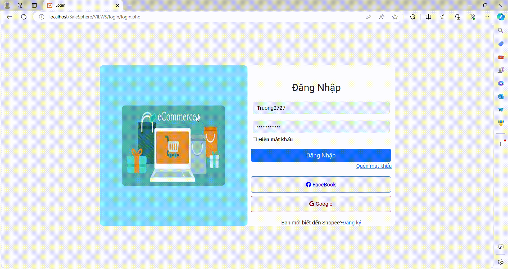

# Sale Sphere Website Project

## Introduction
This project is an e-commerce website with a management system comprising three roles:
- **Customer:** Browse products, place orders, make payments, track orders, and review products.
- **Admin:** Oversees the entire system.
- **System Staff:** Manages product catalog, pricing, promotions, business performance, and order processing.

## Features
  {width=200}
  {width=200}
  {width=200}
  {width=200}
### Customer
- Browse and search for products.
- Add products to cart and checkout.
- Make payments.
- Track order status.
- Review products.

### Admin
- Manage user roles and permissions.
- Configure site-wide settings.
- Monitor sales reports and inventory.

### System Staff
- Manage product catalog, pricing, and promotions.
- Oversee business performance.
- Handle order processing and shipping.
- Provide customer support.

## Technologies Used
- **Frontend:** HTML5, CSS3, JavaScript, Bootstrap5, JQuery.
- **Backend:** PHP.
- **Database:** MySql.
- **Others:** Visual Studio Code, GitHub, Google/Facebook API, Xampp.

## Installation
### Prerequisites
- Xampp Control Panel
- MySql
- Visual Studio Code (or other IDE)

### Steps 
1. Move to ../xampp/htdocs (or different way)
2. Clone the repository:
    ```sh
    git clone https://github.com/BT2701/SaleSphere.git
    ```
3. Navigate to the project directory:
    ```sh
    cd SaleSphere
    ```
4. Open project with localhost:
    ```sh
    http://localhost/SaleSphere/index.php
    ```


## Usage
- **Customer Interface:** 
  In order to access the customer page, you must create a new account or try logging in with an existing account (`username: Truong2003; password: Truong@123456`).
- **Admin Interface:** 
  To access the admin page, try logging in with an existing account (`username: Truong2727; password: Truong@123456`).
- **System Staff Interface:** 
  To access the staff page, try logging in with an existing account (`username: Truong1234; password: Truong@123456`).
## Contributing
We welcome contributions! Please follow these steps to contribute:
1. Fork the repository.
2. Create a new branch:
    ```sh
    git checkout -b feature/your-feature-name
    ```
3. Commit your changes:
    ```sh
    git commit -m 'Add some feature'
    ```
4. Push to the branch:
    ```sh
    git push origin feature/your-feature-name
    ```
5. Open a pull request.

## License
This project is licensed under the MIT License - see the [LICENSE](./LICENSE) file for details.

## Contact
If you have any questions or suggestions, feel free to contact us at [Truong's mail](mailto:dttruonga8tqtpy@gmail.com).
